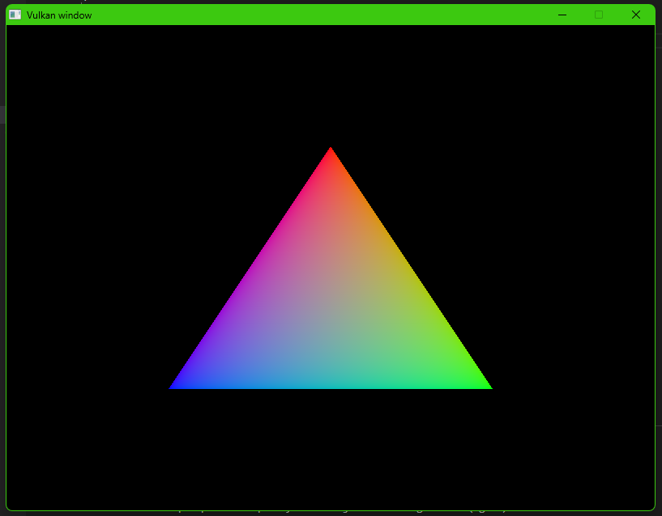

# 01. Hello Triangle

This learning exercise was made possible through https://vulkan-tutorial.com. The majority of this code and the notes found here can be sourced directly from that site.

Vulkan is a (relatively) new API created by Khronos Group, the creators of OpenGL, which saw it's first release in February 2016. Compared to it's predecessor, OpenGL, Vulkan has less overhead and more consistent driver behavior across different platforms and devices. Vulkan allows developers the freedom to more precisely control and optimize their graphics programs than OpenGL does, at the price of being far more verbose and requiring the developer to define and configure every step of the graphical process, from selecting which physical device to use in your machine (if you have multiple GPUs or drivers), to creating your own framebuffer and buffer swapping behavior. Like OpenGL, Vulkan is designed to be cross-platform, able to be run on Windows, Linux, and even Android devices.

This demo also uses GLFW, to handle the window creation process and some small steps in the Vulkan pipeline regarding the creation and handling of the VkSurfaceKHR object.

The steps required to get a simple triangle drawing are documented to varying degrees here, but for extra notes and resources, it's highly recommended you visit https://vulkan-tutorial.com and read through the Vulkan docs on Khronos' official website.

If you want to understand what's happening here, visit the main() function and take a tour through each step of the Vulkan initialization (and destruction) process from there.