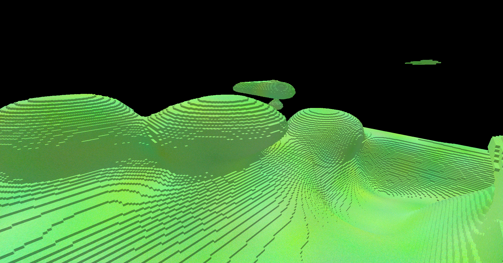
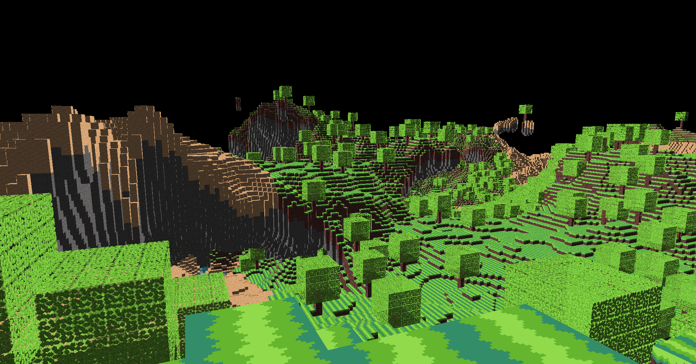
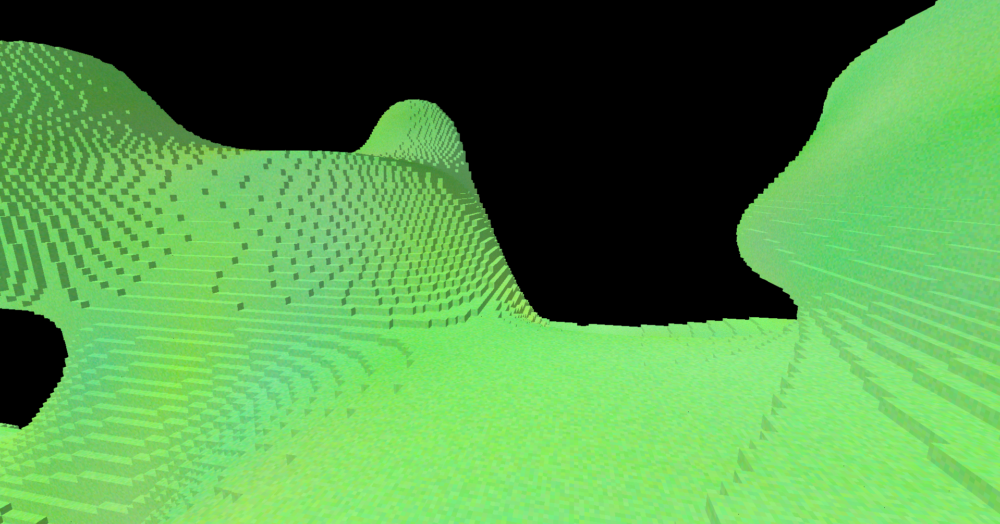

# Experiment 03 - Voxel Engine

## Preamble
When I first began learning OpenGL, alongside C++ throughout late 2017 and early 2018, my first fixation was on voxel engines. Games like Minecraft are what motivated me to learn to code in the first place, so this minor obsession should be unsurprising.

The above image is one such voxel engine, which I made back in July 2018. My primary interest was purely on the procedural generation side, so not much effort was spent on things like being able to place and remove blocks, lighting, gameplay, etc.

I probably made at least a dozen of these, all with different properties and features. Beginning in 2020 I abandoned the blocky look for something different - either dual contouring or (more often) self-implemented marching tetrahedra. One project that made extensive use of the latter was my canned game project [Beaconfall](https://0x0de.itch.io/beaconfall).

Going into learning Vulkan, I figured it might be a good time to revisit voxel engine building, since the theory behind it is very straightforward. This project is currently in active development, alongside a few other Vulkan experiments. My final goal is to have a procedurally generated infinite world in which you can place and destroy voxels at will.

## Known Issues

- You can't place voxels "into" another sector - placing on the border of sector boundaries such that the voxel comes "out of" the sector doesn't work.

## Patch Notes

### v0.3 - September 14, 2025

- Added support for multiple sectors.
- Sectors now generate around the camera, allowing you to (theoretically) traverse a landscape of (2^64)x(2^64)x(2^64) voxels.
- Sector generation is now multi-threaded.
- Optimized the terrain generation algorithm to be many times faster, at the cost of slightly less smooth terrain.
- Removed the selection buffer draw mode - it has served its purpose.

### v0.2 - September 6, 2025
- Added the ability to place and remove blocks.
	- Left click to remove, right click to place.
	- Hold left alt to unfocus the window and select different blocks on-screen.
- Changed sectors from 256x256x256 to 64x64x64, for the sake of being able to reload the sector mesh at runtime.
- Updated the selection buffer to account for the new changes.
- Fixed the camera jumping to the opposite direction when focusing the window for the first time.
- Sectors now generate with a random seed.

### v0.1 - August 30, 2025

- Initial public release, developed alongside v0.6 of my Vulkan framework.
- Implemented a voxel "sector."
    - Sectors are this engine's version of Minecraft's "chunks," being a rectangular collection of voxels rendered as a single mesh.
    - Sectors are currently cubic, and contain 256x256x256 voxels.
    - Sector meshes are built by combining adjacent vertices into a single mesh.
    - The current demo is just a single sector.
- Sectors generate using 3D gradient noise with cosine interpolation.
- Voxels are drawn using gradient and value noise, and also have basic directional lighting.
- Added a number of debugging rendering modes.
    - You can press G to enable wireframe mode (which shows the skeleton of the sector mesh being drawn).
    - You can press H to enable selection buffer mode (which currently doesn't have a use, but shows what the selection buffer will look like when it's implemented).
    - You can press F to revert to normal rendering.
- Added a 3D camera to move around and observe the sector with.